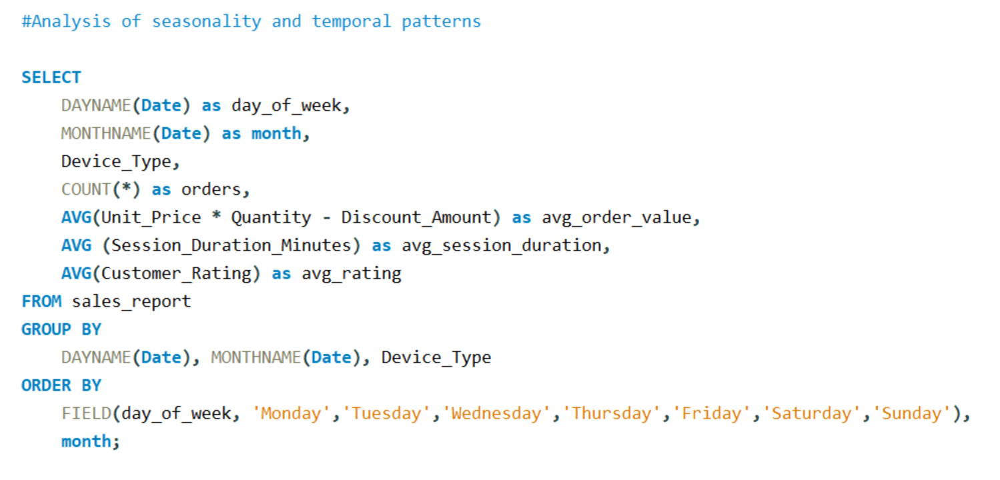
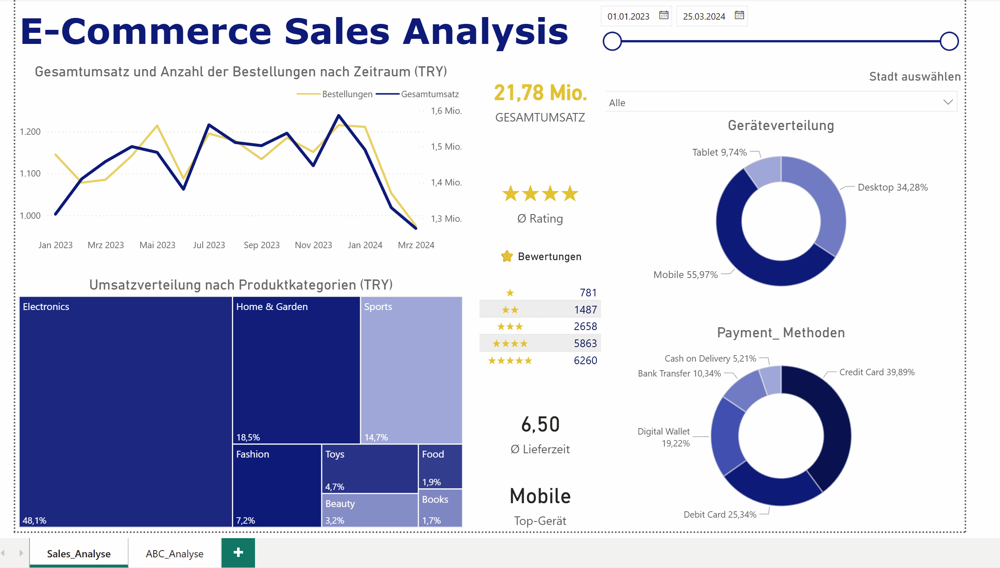
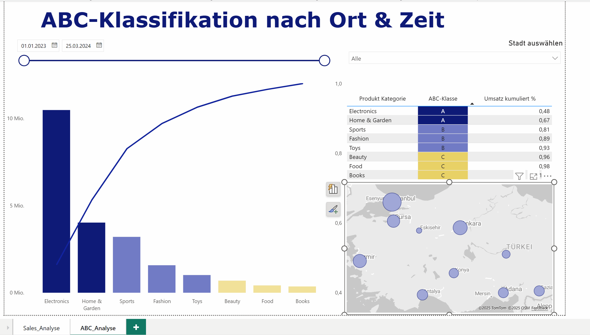
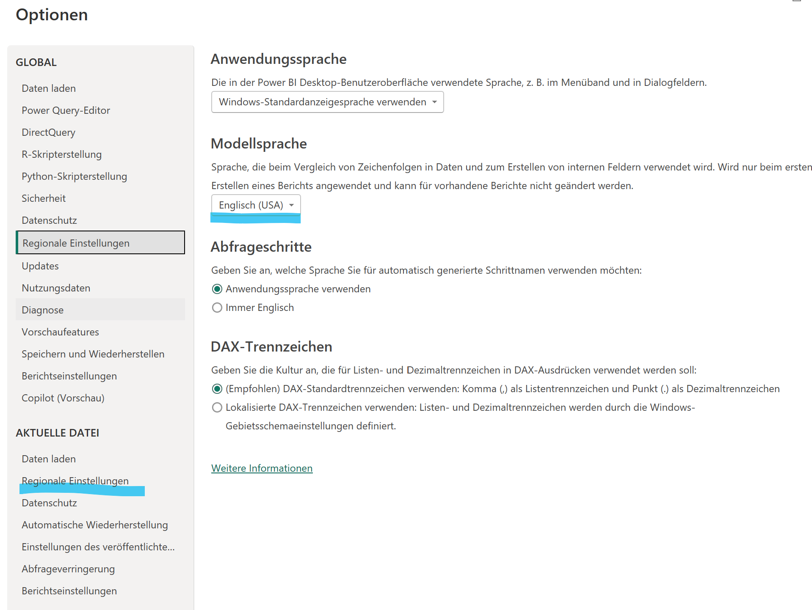
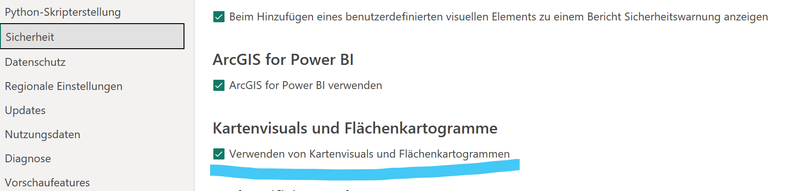

# 📊 E-commerce-Datenanalyse- und Visualisierungsprojekt (Excel → Python → SQL → Power BI)

## Projektübersicht:
Dieses Projekt stellt einen vollständigen Datenanalyse-Workflow im E-Commerce-Bereich dar – von den Rohdaten bis hin zu interaktiven Visualisierungen. Es demonstriert die gesamte Datenpipeline unter Verwendung moderner Tools und Technologien.

## Projektziel:
Die Gewinnung umsetzbarer Erkenntnisse aus einem E-Commerce-Datensatz, um Geschäftsprozesse wie Marketing und Kundenbetreuung zu optimieren.

## 🛠 Verwendete Technologien
- **Python**: Pandas, NumPy für Datenanalyse
- **SQL**: Datenbankdesign und komplexe Abfragen
- **Power BI**: Dashboard-Erstellung und Visualisierung
- **Excel**: Datenvorbereitung und -bereinigung

### Der Workflow im Überblick:

### Datenexploration
- Datensatz von Kaggle heruntergeladen. [E-Commerce Customer Behavior & Sales Analysis -TR](https://www.kaggle.com/code/umuttuygurr/starter-notebook/notebook#%F0%9F%93%82-Load-Data)
- **Erstanalyse** des Rohdatensatzes mit Pandas und NumPy. [Erste Analyse in Jupyter Notebook](2_Python)
- Überprüfung fehlender Werte und doppelter Einträge
- Erste Hypothesenbildung: Welche Produkte generieren den höchsten Umsatz?

### Datenmodellierung
- Identifizierung der Entitäten: Customer, Orders, Payment
- ER-Diagramm in drawSQL erstellt [Entity Diagramm](5_Images/ERP_Diagramm.png)
- Strukturierung und Normalisierung der Daten für relationale Datenbanken
- [Ordner mit Entities](3_Datenbank/Entities)

### Datenmodellierung und -abfrage (SQL)
- Erstellung eines relationalen Datenbankschemas.
- **Übertragung** der aufbereiteten Daten in die Datenbanktabellen.
- Formulierung komplexer SQL-Abfragen, um spezifische geschäftliche Fragestellungen zu beantworten.
- ABC-Analyse mit Fensterfunktionen **implementiert**.
- Validierung der Ergebnisse
- [Ordner mit Abfragen und Normalisierungsdateien](3_Datenbank)



### Datenvisualisierung und Dashboard-Erstellung (Power BI):

- Entwicklung eines interaktiven Dashboards zur übersichtlichen Darstellung der wichtigsten KPIs.
- Visualisierung von Umsatztrends, Kundenverhalten und Produktperformance.
- Erstellung einer benutzerfreundlichen Oberfläche für tiefgehende Data Exploration.

## 📷 Vorschau





⚠️ **Wichtiger Hinweis zu den Daten**
Die CSV-Datei verwendet Punkte als Dezimaltrennzeichen. Beim Laden in Power BI:

- Stellen Sie sicher, dass die regionalen Einstellungen auf Englisch (USA) eingestellt sind
- Oder konvertieren Sie die Datentypen der Spalten explizit in "Dezimalzahl"

**Erforderliche Power BI Einstellungen:**
- Regionale Einstellungen: Englisch (USA)


- Kartenvisualisierungen müssen aktiviert sein


## 🐍 Python Umgebung einrichten

### Für die Datenanalyse (Basis):
```bash
pip install -r requirements.txt